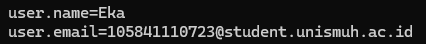
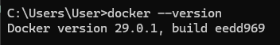
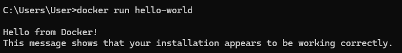
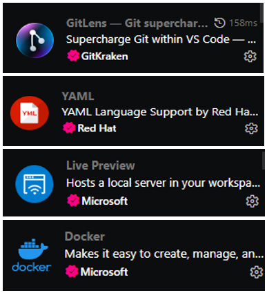

# 📋 Laporan Praktikum Pertemuan 01
## DevOps Culture & Principles

---

## 👤 Identitas Mahasiswa

| Item | Keterangan |
|------|------------|
| **Nama** | MUH. EKA ANDRI SETIAWAN |
| **NIM** | 105841110723 |
| **Kelas** | 5C |
| **Tanggal** | 2026-02-24 |

---

## 📚 Pemahaman DevOps

### Apa itu DevOps?

DevOps adalah sebuah pendekatan, filosofi, dan budaya kerja dalam pengembangan perangkat lunak yang menggabungkan tim Development (pengembang) dan Operations (operasional) agar bekerja secara kolaboratif sepanjang siklus hidup aplikasi. Secara konsep, DevOps bertujuan menghilangkan batas atau sekat (silo) antara kedua tim yang sebelumnya sering bekerja terpisah. Dalam model tradisional, developer fokus membuat fitur baru secepat mungkin, sedangkan tim operations fokus menjaga stabilitas sistem. Perbedaan fokus ini sering menimbulkan konflik, keterlambatan rilis, serta kesalahan saat deployment.

Konsep utama DevOps adalah kolaborasi, komunikasi yang terbuka, serta otomatisasi proses. DevOps mendorong penggunaan praktik seperti Continuous Integration (CI), Continuous Delivery (CD), automated testing, monitoring, dan Infrastructure as Code (IaC). Dengan pendekatan ini, proses pengembangan menjadi berkelanjutan (continuous), mulai dari perencanaan, penulisan kode, pengujian, hingga deployment dan monitoring dilakukan secara terintegrasi.

Tujuan utama DevOps adalah mempercepat proses pengiriman perangkat lunak tanpa mengorbankan kualitas dan stabilitas sistem. Selain itu, DevOps juga bertujuan meningkatkan efisiensi kerja tim, meminimalkan human error melalui otomatisasi, serta mempercepat respons terhadap perubahan atau permasalahan sistem.

Manfaat DevOps sangat signifikan, di antaranya adalah waktu rilis yang lebih cepat, deteksi bug lebih awal, pemulihan sistem yang lebih cepat saat terjadi gangguan, serta peningkatan kepuasan pelanggan karena aplikasi lebih stabil dan sering diperbarui. Selain itu, DevOps juga meningkatkan kerja sama tim dan produktivitas secara keseluruhan.

### Mengapa DevOps penting dalam industri software saat ini?

DevOps penting dalam industri software saat ini karena kebutuhan pasar menuntut aplikasi yang cepat dikembangkan, sering diperbarui, dan tetap stabil. Di era digital, perusahaan harus mampu merilis fitur baru dalam hitungan hari bahkan jam, bukan lagi bulan. Jika proses pengembangan lambat dan penuh hambatan, perusahaan bisa tertinggal dari kompetitor.

Salah satu alasan utama pentingnya DevOps adalah kecepatan dan efisiensi. Dengan praktik seperti Continuous Integration (CI) dan Continuous Delivery (CD), proses build, testing, dan deployment dapat dilakukan secara otomatis. Hal ini mengurangi pekerjaan manual dan mempercepat waktu rilis produk (time to market).

### Contoh perusahaan yang sukses menerapkan DevOps

1️⃣ Netflix

Netflix merupakan salah satu contoh perusahaan yang sangat berhasil menerapkan DevOps. Sebagai platform streaming global dengan jutaan pengguna, Netflix harus memastikan sistemnya selalu tersedia dan mampu menangani traffic yang sangat besar.

Netflix menerapkan praktik Continuous Delivery, di mana tim developer dapat melakukan deployment kode ke production secara otomatis dan berkala tanpa mengganggu layanan pengguna. Mereka juga menggunakan konsep microservices architecture, sehingga setiap layanan (seperti sistem rekomendasi, streaming, atau billing) berjalan secara terpisah namun saling terhubung.

Selain itu, Netflix dikenal dengan praktik Chaos Engineering, yaitu sengaja menguji ketahanan sistem dengan mensimulasikan gangguan untuk memastikan aplikasi tetap stabil. Hal ini menunjukkan penerapan prinsip automation, measurement, dan culture dalam DevOps.

2️⃣ Amazon

Amazon juga merupakan perusahaan yang sukses menerapkan DevOps dalam skala besar. Dengan jutaan transaksi setiap hari, Amazon membutuhkan sistem yang cepat, stabil, dan selalu tersedia.

Amazon menerapkan otomatisasi dalam proses build, testing, dan deployment melalui CI/CD pipeline. Developer di Amazon dapat melakukan deployment ribuan kali dalam sehari dengan risiko minimal karena sistem pengujian dan monitoring dilakukan secara otomatis.

Selain itu, Amazon membangun budaya “You build it, you run it”, yang berarti tim developer bertanggung jawab penuh terhadap aplikasi yang mereka buat, termasuk operasionalnya. Pendekatan ini mencerminkan prinsip culture dan sharing dalam DevOps.

---

## 🎯 Pemahaman Prinsip CALMS

1️⃣ Culture (Budaya)

Culture adalah fondasi utama DevOps. Prinsip ini menekankan pentingnya kolaborasi, komunikasi terbuka, dan rasa tanggung jawab bersama antara tim Development dan Operations. Dalam DevOps, tidak ada lagi budaya saling menyalahkan ketika terjadi kesalahan. Sebaliknya, tim bekerja sama mencari solusi dan melakukan evaluasi untuk perbaikan sistem.

Contoh penerapan:

Melakukan daily standup meeting untuk koordinasi tim.

Mengadakan blameless postmortem ketika terjadi kegagalan sistem.

Menerapkan budaya “You build it, you run it” di mana developer ikut bertanggung jawab terhadap aplikasi di production.

2️⃣ Automation (Otomatisasi)

Automation bertujuan mengurangi pekerjaan manual yang berulang dan rawan kesalahan. Dengan otomatisasi, proses seperti build, testing, dan deployment dapat dilakukan lebih cepat dan konsisten.

Contoh penerapan:

Menggunakan CI/CD pipeline untuk otomatis menjalankan testing setiap kali ada commit kode.

Otomatisasi deployment ke server menggunakan tools seperti Jenkins atau GitHub Actions.

Menggunakan Infrastructure as Code (IaC) untuk mengatur server secara otomatis.

3️⃣ Lean (Ramping/Efisien)

Lean berfokus pada pengurangan pemborosan dalam proses kerja dan meningkatkan efisiensi. Prinsip ini menekankan pengiriman fitur dalam skala kecil namun sering, sehingga risiko kesalahan dapat diminimalkan.

Contoh penerapan:

Mengurangi proses approval yang berlapis-lapis.

Mengirim update kecil secara berkala daripada update besar sekaligus.

Menghindari pekerjaan yang tidak memberikan nilai tambah bagi pengguna.

4️⃣ Measurement (Pengukuran)

Measurement berarti mengukur segala aspek penting dalam sistem agar dapat dianalisis dan diperbaiki. Data digunakan sebagai dasar pengambilan keputusan, bukan asumsi.

Contoh penerapan:

Memantau performa aplikasi seperti penggunaan CPU, RAM, dan response time.

Mengukur frekuensi deployment dan waktu pemulihan saat terjadi gangguan.

Menggunakan tools monitoring seperti Prometheus atau Grafana.

5️⃣ Sharing (Berbagi)

Sharing menekankan pentingnya berbagi pengetahuan, pengalaman, dan dokumentasi antar anggota tim. Dengan berbagi, seluruh tim dapat berkembang bersama dan mengurangi ketergantungan pada satu individu.

Contoh penerapan:

Membuat dokumentasi sistem yang terpusat.

Mengadakan sesi sharing atau workshop internal.

Menggunakan knowledge base atau wiki perusahaan.

---

## 🔧 Setup Development Environment

### Versi Software

| Software | Versi |
|----------|-------|
| Git | Version 2.50.1 |
| Docker | Version 29.0.1 |

### Konfigurasi Git

```
user.name = Eka
user.email = 105841110723@student.unismuh.ac.id
```

### VS Code Extensions

1. Docker
2. GitLens
3. YAML
4. Live Preview

### GitHub Account

- Username: Ekaandri28

---

## 📸 Screenshots

| No | Screenshot | Keterangan |
|----|------------|------------|
| 1 |  | git --version |
| 2 |  |  git config --list |
| 3 |  | docker --version |
| 4 |  | docker run hello-world |
| 5 |  | VS Code dengan extensions |

---

## 💭 Refleksi Pribadi

### Apa harapan Anda dari praktikum DevOps ini?

Saya berharap praktikum ini dapat memberikan pemahaman yang komprehensif dan aplikatif mengenai siklus pengembangan perangkat lunak dalam konteks industri modern. Selain itu, saya ingin memperoleh pengalaman langsung dalam penggunaan berbagai tools yang menjadi standar di lingkungan profesional, sehingga mampu memahami alur kerja yang terstruktur dan sistematis.

### Skill apa yang ingin Anda kuasai di akhir semester?

Saya ingin untuk mengembangkan kemampuan dalam mengotomatisasi proses Continuous Integration dan Continuous Deployment (CI/CD). Saya juga ingin meningkatkan kompetensi dalam penggunaan Git untuk kolaborasi tingkat lanjut, termasuk penerapan strategi branching yang efektif. Di samping itu, saya berupaya memahami konsep dasar containerization serta implementasinya menggunakan Docker.

### Tantangan apa yang Anda hadapi saat mengerjakan praktikum ini?

Tantangan utama yang saya hadapi adalah memahami secara mendalam alur kerja sistem version control, seperti mekanisme fork, sinkronisasi repository, dan manajemen commit. Selain itu, proses konfigurasi awal lingkungan pengembangan, termasuk memastikan Docker dan tools pendukung lainnya berjalan dengan stabil tanpa kendala teknis, menjadi tantangan tersendiri pada tahap awal pembelajaran.

---

## ✅ Checklist

- [x] Git terinstall dan terkonfigurasi dengan benar
- [x] Docker dapat menjalankan container hello-world
- [x] VS Code terinstall dengan semua extensions yang diminta
- [x] Laporan ditulis dengan bahasa yang baik dan benar
- [x] Semua screenshot jelas dan terbaca

---

*Laporan ini dibuat pada Selasa, 24 Februari 2026*
