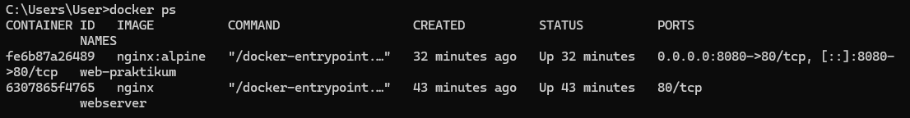
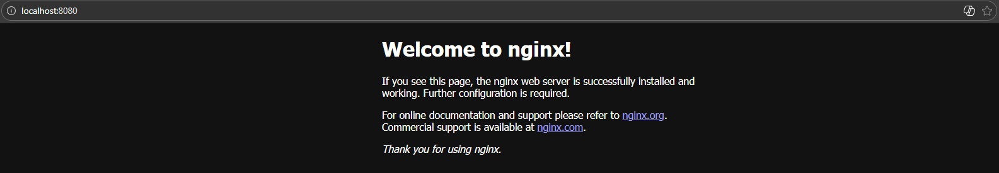
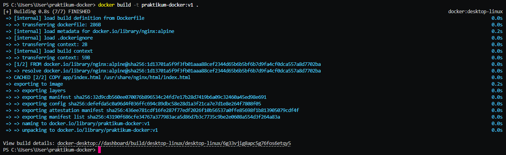
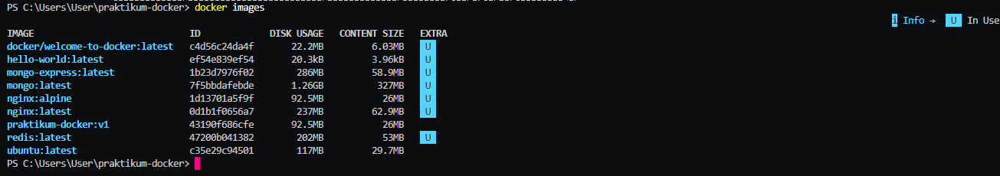
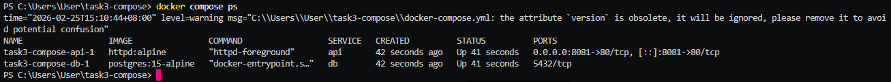
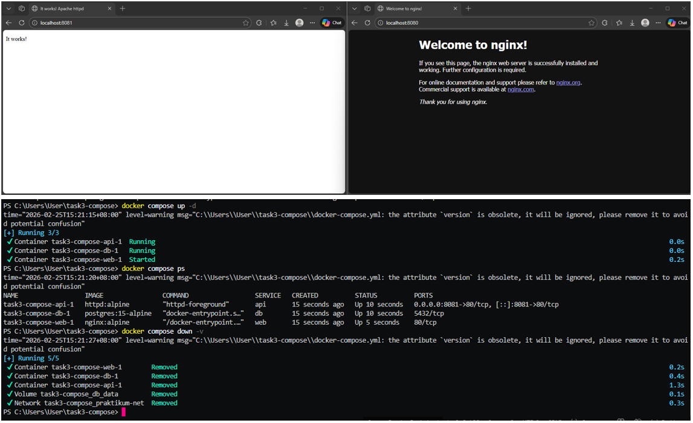

# 🐳 Laporan Praktikum Pertemuan 02
## Docker Fundamentals

---

## 👤 Identitas Mahasiswa

| Item | Keterangan |
|------|------------|
| **Nama** | MUH. EKA ANDRI SETIAWAN |
| **NIM** | 105841110723 |
| **Kelas** | 5C |
| **Tanggal** | 2026-02-25 |

---

## 📚 Pemahaman Docker

### Apa itu Docker?

Docker adalah platform containerization yang digunakan untuk membangun, mengemas, dan menjalankan aplikasi dalam suatu lingkungan terisolasi yang disebut container. Docker memungkinkan aplikasi berjalan secara konsisten di berbagai lingkungan, karena seluruh dependensi dan konfigurasi yang dibutuhkan telah dikemas dalam satu paket.

Container adalah unit eksekusi ringan yang berisi aplikasi beserta seluruh library, dependensi, dan konfigurasi yang diperlukan untuk menjalankannya. Container berjalan di atas sistem operasi host dengan berbagi kernel yang sama, sehingga lebih efisien dan cepat dibandingkan mesin virtual.

Image adalah template atau cetakan dasar yang digunakan untuk membuat container. Image bersifat statis dan tidak berubah, sedangkan container merupakan hasil eksekusi dari image tersebut.

Perbedaan utama antara container dan virtual machine (VM) terletak pada arsitekturnya. Virtual machine menjalankan sistem operasi tersendiri di atas hypervisor, sehingga membutuhkan sumber daya yang lebih besar. Sementara itu, container tidak memerlukan sistem operasi terpisah karena berbagi kernel dengan host, sehingga lebih ringan, cepat dijalankan, dan efisien dalam penggunaan resource.

### Jelaskan Komponen Utama Docker (Images, Containers, Registry)

1.  Image adalah template atau cetakan dasar yang digunakan untuk membuat container. Image berisi aplikasi, dependensi, library, serta konfigurasi yang diperlukan agar aplikasi dapat berjalan. Image bersifat read-only dan tidak berubah. Dari satu image, dapat dibuat banyak container dengan konfigurasi yang sama.

2.  Container adalah instansi yang berjalan dari sebuah image. Container merupakan lingkungan terisolasi yang menjalankan aplikasi beserta seluruh dependensinya. Berbeda dengan image yang bersifat statis, container bersifat dinamis karena dapat dijalankan, dihentikan, dimodifikasi, maupun dihapus sesuai kebutuhan.

3.  Registry adalah tempat penyimpanan dan distribusi image Docker. Registry memungkinkan pengguna untuk mengunggah (push) dan mengunduh (pull) image. Contoh registry publik yang umum digunakan adalah Docker Hub. Registry dapat bersifat publik maupun privat sesuai kebutuhan organisasi.

### Perbedaan Docker vs Virtual Machine

Perbedaan Docker Container dan Virtual Machine (VM) terletak pada arsitektur, penggunaan sumber daya, dan cara menjalankan sistem operasi.

Docker Container adalah lingkungan terisolasi yang berjalan di atas sistem operasi host dan berbagi kernel yang sama. Container hanya mengemas aplikasi beserta dependensinya tanpa membawa sistem operasi lengkap. Karena itu, container bersifat ringan, cepat dijalankan, dan lebih efisien dalam penggunaan CPU serta memori.

Virtual Machine (VM) adalah mesin virtual yang berjalan di atas hypervisor dan memiliki sistem operasi sendiri (guest OS). Setiap VM memerlukan alokasi resource tersendiri seperti CPU, RAM, dan storage, sehingga ukurannya lebih besar dan waktu booting lebih lama dibanding container.

---

## 🔧 Praktik Docker Commands

### Output docker ps -a

```
CONTAINER ID   IMAGE          COMMAND                  CREATED          STATUS          PORTS                                     NAMES

fe6b87a26489   nginx:alpine   "/docker-entrypoint.…"   32 minutes ago   Up 32 minutes   0.0.0.0:8080->80/tcp, [::]:8080->80/tcp   web-praktikum

6307865f4765   nginx          "/docker-entrypoint.…"   43 minutes ago   Up 43 minutes   80/tcp                                    webserver
```

### Output docker images

```
docker/welcome-to-docker:latest   c4d56c24da4f       22.2MB         6.03MB    U
hello-world:latest                ef54e839ef54       20.3kB         3.96kB    U
httpd:alpine                      8f26f33a7002       96.6MB         20.8MB
mongo-express:latest              1b23d7976f02        286MB         58.9MB    U
mongo:latest                      7f5bbdafebde       1.26GB          327MB    U
nginx:alpine                      1d13701a5f9f       92.5MB           26MB    U
nginx:latest                      0d1b1f0656a7        237MB         62.9MB    U
postgres:15-alpine                5fe8ca7fc662        392MB          109MB
praktikum-docker:v1               43190f686cfe       92.5MB           26MB    U
redis:latest                      47200b041382        202MB           53MB    U
ubuntu:latest    
```

### Docker Run Command

```bash
docker run -d -p 5000:5000 --name web-app flask-app
```

---

## 📄 Dockerfile

### Isi Dockerfile

```dockerfile
FROM nginx:alpine
COPY app/index.html /usr/share/nginx/html/index.html
EXPOSE 80
CMD ["nginx", "-g", "daemon off;"]
```

### Jelaskan setiap baris Dockerfile Anda

FROM nginx:alpine

Baris ini digunakan untuk menentukan base image yang akan dipakai.
Artinya container dibuat berdasarkan image Nginx versi ringan (alpine) yang sudah berisi web server siap pakai.

COPY app/index.html /usr/share/nginx/html/index.html

Perintah ini digunakan untuk menyalin file dari komputer lokal ke dalam container.
File index.html akan ditempatkan di folder default Nginx sehingga bisa ditampilkan saat web server dijalankan.

EXPOSE 80

Perintah ini digunakan untuk memberi tahu bahwa container menggunakan port 80 sebagai jalur komunikasi (HTTP).

CMD ["nginx", "-g", "daemon off;"]

Perintah ini digunakan untuk menentukan proses utama yang dijalankan saat container start, yaitu menjalankan Nginx agar tetap aktif dan tidak langsung berhenti.

---

## 🐙 Docker Compose

### Isi docker-compose.yml

```yaml
version: '3.8'

services:
  web:
    image: nginx:alpine
    ports:
      - "8080:80"
    volumes:
      - ./app:/usr/share/nginx/html:ro
    depends_on:
      - api
    networks:
      - praktikum-net

  api:
    image: httpd:alpine
    ports:
      - "8081:80"
    networks:
      - praktikum-net

  db:
    image: postgres:15-alpine
    environment:
      POSTGRES_USER: praktikum
      POSTGRES_PASSWORD: devops123
      POSTGRES_DB: praktikum_db
    volumes:
      - db_data:/var/lib/postgresql/data
    networks:
      - praktikum-net

networks:
  praktikum-net:
    driver: bridge

volumes:
  db_data:
```

### Jelaskan struktur docker-compose.yml Anda

version: '3.8'

Menentukan versi sintaks Docker Compose yang digunakan untuk menulis konfigurasi.

services:

Bagian utama yang berisi daftar layanan (container) yang akan dijalankan.
Dalam file ini terdapat tiga service yaitu web, api, dan db.

web

Service yang menjalankan web server menggunakan image Nginx.
Berfungsi untuk menampilkan aplikasi ke browser melalui port 8080.

api

Service yang menjalankan server menggunakan image Apache (httpd).
Diakses melalui port 8081 dan terhubung ke jaringan yang sama dengan service lain.

db

Service database menggunakan PostgreSQL.
Dilengkapi dengan pengaturan username, password, dan nama database melalui environment variable serta menggunakan volume agar data tersimpan permanen.

ports

Digunakan untuk menghubungkan port di komputer (host) dengan port di dalam container.

volumes

Digunakan untuk menyimpan data atau menyinkronkan folder antara host dan container.

depends_on

Menentukan urutan service dijalankan (misalnya web bergantung pada api).

networks

Mendefinisikan jaringan agar antar container dapat saling berkomunikasi.

### Output Docker Compose Up

```
time="2026-02-25T15:42:21+08:00" level=warning msg="C:\\Users\\User\\task3-compose\\docker-compose.yml: the attribute `version` is obsolete, it will be ignored, please remove it to avoid potential confusion"
[+] Running 2/2
 ✔ Container task3-compose-db-1   Running                                                                                                                                           0.0s 
 ✔ Container task3-compose-api-1  Running                                                                                                                                           0.0s 
Attaching to api-1, db-1, web-1
web-1  | /docker-entrypoint.sh: /docker-entrypoint.d/ is not empty, will attempt to perform configuration
web-1  | /docker-entrypoint.sh: Looking for shell scripts in /docker-entrypoint.d/
web-1  | /docker-entrypoint.sh: Launching /docker-entrypoint.d/10-listen-on-ipv6-by-default.sh                                                                                           
web-1  | 10-listen-on-ipv6-by-default.sh: info: Getting the checksum of /etc/nginx/conf.d/default.conf                                                                                   
web-1  | 10-listen-on-ipv6-by-default.sh: info: Enabled listen on IPv6 in /etc/nginx/conf.d/default.conf
web-1  | /docker-entrypoint.sh: Sourcing /docker-entrypoint.d/15-local-resolvers.envsh
web-1  | /docker-entrypoint.sh: Launching /docker-entrypoint.d/20-envsubst-on-templates.sh                                                                                               
web-1  | /docker-entrypoint.sh: Launching /docker-entrypoint.d/30-tune-worker-processes.sh
web-1  | /docker-entrypoint.sh: Configuration complete; ready for start up
web-1  | 2026/02/25 07:42:22 [notice] 1#1: using the "epoll" event method
web-1  | 2026/02/25 07:42:22 [notice] 1#1: nginx/1.29.5
web-1  | 2026/02/25 07:42:22 [notice] 1#1: built by gcc 15.2.0 (Alpine 15.2.0)
web-1  | 2026/02/25 07:42:22 [notice] 1#1: OS: Linux 6.6.87.2-microsoft-standard-WSL2
web-1  | 2026/02/25 07:42:22 [notice] 1#1: getrlimit(RLIMIT_NOFILE): 1048576:1048576
web-1  | 2026/02/25 07:42:22 [notice] 1#1: start worker processes
web-1  | 2026/02/25 07:42:22 [notice] 1#1: start worker process 30
web-1  | 2026/02/25 07:42:22 [notice] 1#1: start worker process 31
web-1  | 2026/02/25 07:42:22 [notice] 1#1: start worker process 32
web-1  | 2026/02/25 07:42:22 [notice] 1#1: start worker process 33
web-1  | 2026/02/25 07:42:22 [notice] 1#1: start worker process 34
web-1  | 2026/02/25 07:42:22 [notice] 1#1: start worker process 35
web-1  | 2026/02/25 07:42:22 [notice] 1#1: start worker process 36
web-1  | 2026/02/25 07:42:22 [notice] 1#1: start worker process 37
web-1  | 2026/02/25 07:42:22 [notice] 1#1: start worker process 38
web-1  | 2026/02/25 07:42:22 [notice] 1#1: start worker process 39
web-1  | 2026/02/25 07:42:22 [notice] 1#1: start worker process 40
web-1  | 2026/02/25 07:42:22 [notice] 1#1: start worker process 41
web-1  | 2026/02/25 07:42:22 [notice] 1#1: start worker process 42
web-1  | 2026/02/25 07:42:22 [notice] 1#1: start worker process 43
web-1  | 2026/02/25 07:42:22 [notice] 1#1: start worker process 44
web-1  | 2026/02/25 07:42:22 [notice] 1#1: start worker process 45      
```

---

## 📸 Screenshots

| No | Screenshot | Keterangan |
|----|------------|------------|
| 1 |  | Container Docker sedang berjalan (hasil perintah docker ps) |
| 2 |  | Tampilan Nginx default page di browser (localhost) |
| 3 |  | Proses build image menggunakan perintah docker build |
| 4 |  | Image custom berhasil dibuat dan terlihat pada docker images |
| 5 |  | Daftar service yang berjalan menggunakan docker compose ps |
| 6 |  | Tampilan service Docker Compose yang berjalan dan dapat diakses melalui browser |

---

## 💭 Refleksi & Kesimpulan

### Apa yang Anda pelajari dari praktikum Docker ini?

Melalui praktikum ini, saya memahami bagaimana Docker digunakan untuk membangun dan menjalankan aplikasi dalam bentuk container yang terisolasi. Saya belajar membuat Dockerfile untuk membangun image, menjalankan container dari image tersebut, serta mengelola beberapa service sekaligus menggunakan docker-compose. Praktikum ini juga membantu saya memahami hubungan antara image, container, port, network, dan volume secara langsung melalui praktik.

### Bagaimana Docker dapat membantu dalam pengembangan software?

Docker membantu memastikan aplikasi dapat berjalan dengan konfigurasi yang sama di berbagai lingkungan, baik di komputer pengembang maupun di server. Dengan container, seluruh dependensi aplikasi sudah dikemas menjadi satu, sehingga tidak perlu lagi melakukan instalasi manual di setiap perangkat. Hal ini membuat proses pengembangan, pengujian, dan deployment menjadi lebih konsisten, efisien, dan minim kesalahan konfigurasi.

### Tantangan yang dihadapi dan solusinya

Kesulitan yang saya alami adalah memahami cara kerja port mapping dan bagaimana container berkomunikasi dengan host. Awalnya saya kurang memahami perbedaan antara port di dalam container dan port di komputer lokal. Untuk mengatasinya, saya mencoba beberapa konfigurasi berbeda dan mengamati hasilnya melalui browser serta perintah docker ps. Dengan praktik langsung tersebut, saya akhirnya dapat memahami cara kerja pemetaan port dan jaringan pada Docker dengan lebih jelas.

---

## ✅ Checklist

- [x] Berhasil membuat Dockerfile yang valid
- [x] Berhasil build Docker image
- [x] Container berjalan dan aplikasi bisa diakses
- [x] Docker Compose berhasil dijalankan
- [x] Semua screenshot lengkap dan jelas
- [x] Penjelasan ditulis dengan bahasa sendiri

---

*Laporan ini dibuat pada Selasa, 25 Februari 2026*
